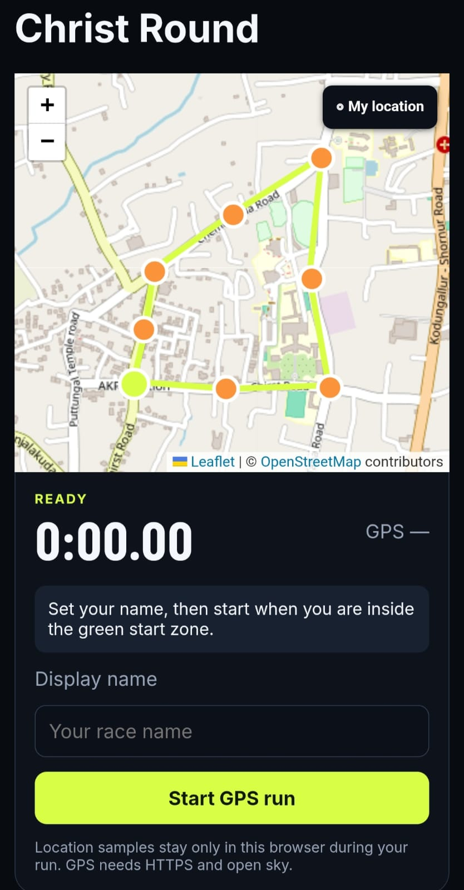
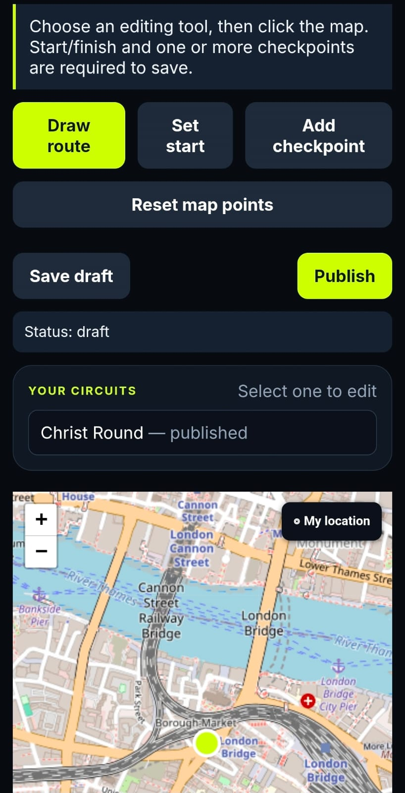

# Maniac 🎯

## Basic Details

### Team Name

Voyager

### Team Members

- Aryan Baburajan - Christ College of Engineering

### Project Description

Maniac is a “real-life Trackmania” web app for GPS-timed laps on developer-created real-world circuits. Players race through a start/finish zone and ordered checkpoint zones, keep local personal bests, and submit times to a shared leaderboard.

### The Problem (that doesn't exist)

People keep walking, cycling, or driving the same routes without a leaderboard telling them whether they took the fastest line.

### The Solution (that nobody asked for)

Turn parks, campuses, and quiet roads into casual race circuits. One developer makes the course; everyone else tries to set a faster lap using nothing but their browser GPS and an unreasonable amount of competitive spirit.

## Technical Details

### Technologies/Components Used

For Software:

- Languages: TypeScript, SQL
- Frameworks: Next.js, React
- Libraries: Leaflet, React Leaflet, Supabase JavaScript client, Vitest
- Tools: Supabase, OpenStreetMap tiles, npm

For Hardware:

- A GPS-capable phone or computer
- Internet access and HTTPS in production

### Implementation

For Software:

#### Installation

```bash
npm install
cp .env.example .env.local
```

Configure `.env.local`:

```dotenv
NEXT_PUBLIC_SUPABASE_URL=https://your-project.supabase.co
SUPABASE_SERVICE_ROLE_KEY=your-server-only-secret-key
ADMIN_PASSPHRASE=a-long-unique-passphrase
```

Run [supabase/schema.sql](supabase/schema.sql) in the Supabase SQL Editor to create the `tracks` and `runs` tables.

#### Run

```bash
npm run dev
```

Open `http://localhost:3000`; the protected circuit creator is at `/admin`.

#### How it works

1. The creator sets a start/finish zone, ordered checkpoints, and a visual route preview on the map.
2. The player arms a lap while inside the start zone, then leaves it to start timing.
3. Each checkpoint must be entered and exited to count; completed checkpoints turn green.
4. Returning to the start/finish zone after every checkpoint stops the clock and submits the lap.

### Project Documentation

For Software:

#### Screenshots (Add at least 3)


*A published circuit in the player discovery view.*


*The player course map and race HUD, ready to begin a GPS-timed lap.*


*The developer workspace for drawing a route and publishing a circuit.*

#### Diagrams


*Creator publishes a circuit → player runs it with GPS → a lightweight result is saved to Supabase.*

For Hardware:

#### Schematic & Circuit

Not applicable — this is a browser-based software project.

### Project Demo

#### Additional Demos

- `npm test` verifies the lap progression and personal-best logic.
- `npm run build` runs the production build and type check.

## Team Contributions

- Aryan Baburajan: Built the Maniac GPS racing experience, circuit creator, Supabase integration, and project documentation.
- [Name 3]: [Specific contributions]

---

Made with ❤️ at TinkerHub Useless Projects


